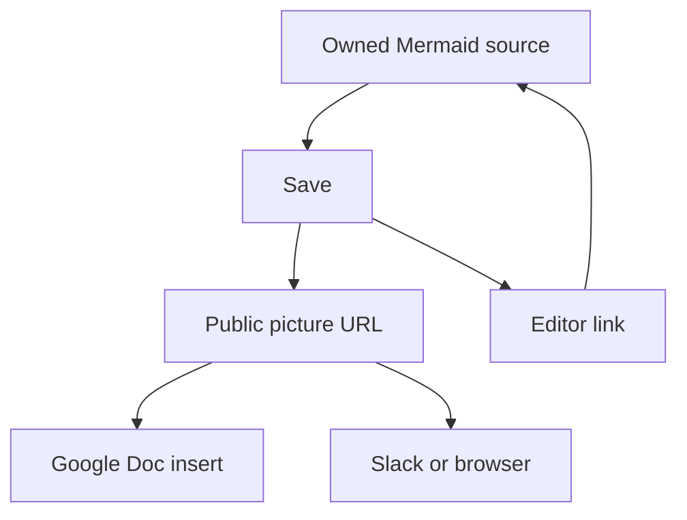
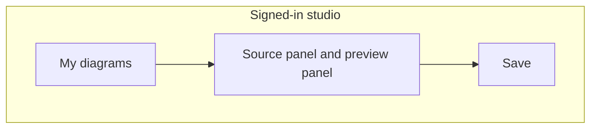
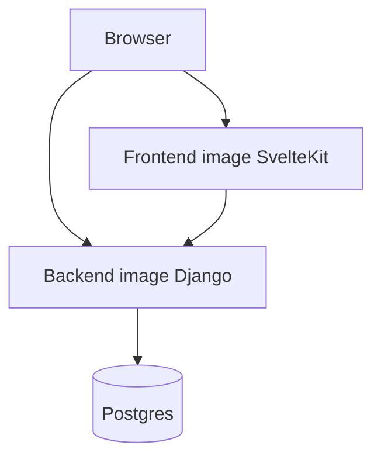
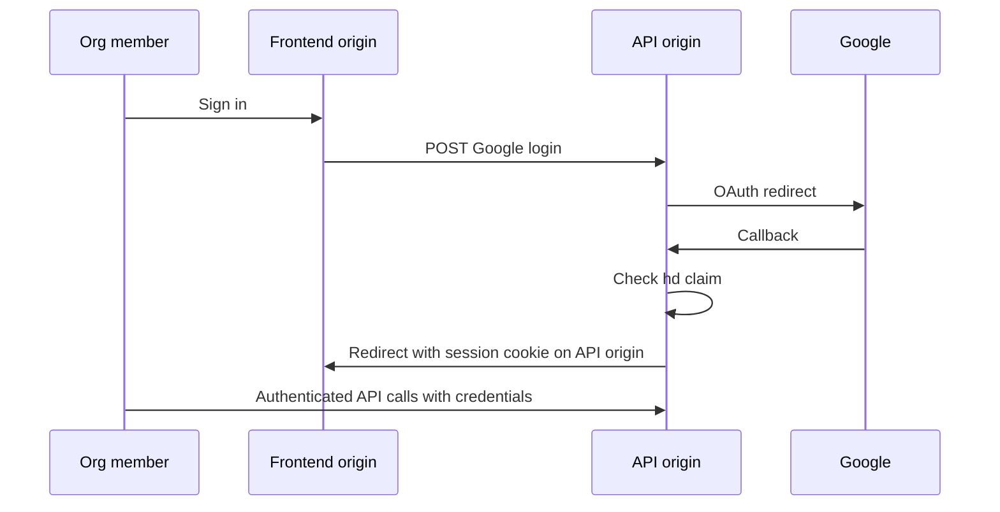
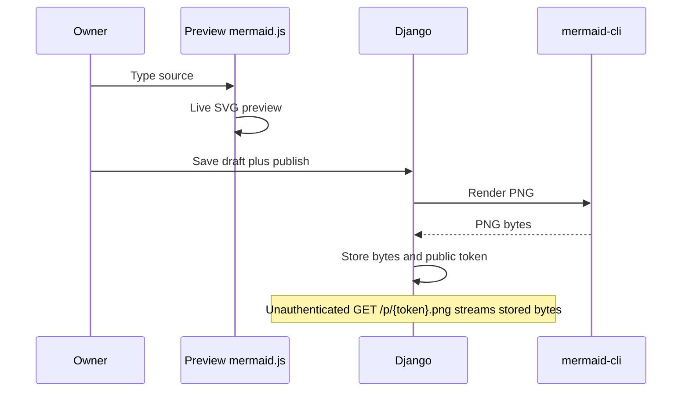
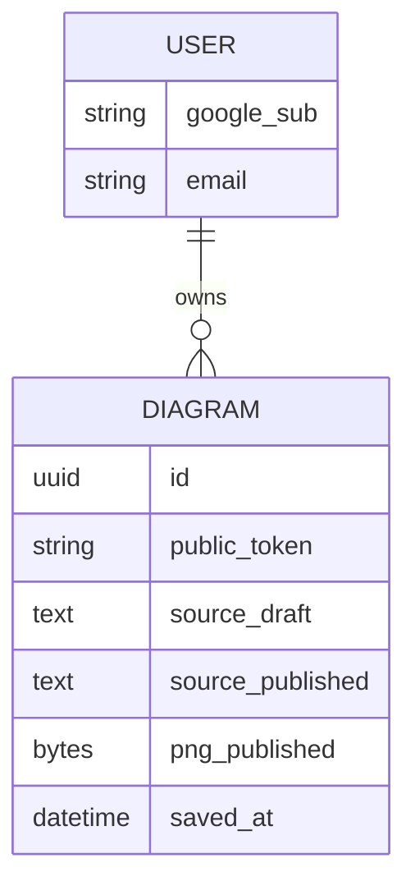

# Open Mermaid Studio - Plan

## Goal Capsule

- **Objective:** Ship an internal Mermaid studio where Nirvana people sign in with Google, keep diagrams they can reopen, and publish a live public picture plus an edit link so a Google Doc and Slack can show the latest save.
- **Product authority:** This plan owns the first product (edit, preview, save, share, Google org login, local Docker including Postgres, and repo conventions). Adjacent paid diagram tools and anonymous paste-first hosts are out of identity, not later phases of this plan.
- **Stop conditions:** Do not ship EKS manifests, Helm, or cluster Ingress in this plan. Do not add unpublish, version history, folders, AI, or live multiplayer.
- **Execution profile:** New repo from stub. API and auth test-first. Compose smoke after both images exist. Frontend preview can be unit-tested; mermaid-cli render needs an integration or container smoke.
- **Tail ownership:** The implementer owns leftover dead-end scaffolding (extra adapters, unused BFF, unused render sidecars).
- **Open blockers:** None.
- **Product Contract preservation:** unchanged

---

## Product Contract

### Summary

Open Mermaid is a signed-in studio: a list of your diagrams, source beside a live preview, and Save as the publish step. Unauthenticated viewers can fetch the latest picture; only org Google users can edit. A Google Doc can insert that picture and keep a link back to the editor.

### Problem Frame

The team already writes Mermaid, but not often enough to pay for a diagram product. GitHub will render Mermaid inside Markdown, which helps pull requests, and does not give a picture URL a Google Doc can keep showing. The costly job is putting a diagram into Slack or a Doc and still owning the source so it can be edited later.

### Key Decisions

- Personal studio as home, not a paste-first pad or a URL-as-home canvas. (session-settled: user-directed — chosen over URL-as-document and publish-first: owning and reopening is why the tool exists) Governs R1, R4, R5.
- Anyone with the link can view; only org Google users can edit. (session-settled: user-directed — chosen over org-only viewing: a Google Doc cannot display a login-gated picture) Governs R8, R9, R10.
- Share surfaces always show the latest successful Save, not a frozen snapshot. (session-settled: user-directed — chosen over snapshots: the Doc should track the owned diagram) Governs R7, R11.
- Save publishes; drafting does not. (session-settled: user-approved — chosen over autosave-to-public: a Doc should stay still while the author types; autosave later reuses the same publish path) Governs R6, R7.
- v1 includes both an insertable picture and a link back to edit. (session-settled: user-directed — chosen over image-only or hyperlink-only: success is a diagram sitting in a real Doc) Governs R9, R10.
- First product is the full studio, not an editor-only or share-only slice. (session-settled: user-directed — chosen over slicing: editor, save, share, login, and local Docker are one outcome) Governs R1–R14.
- Postgres holds saved diagrams. (session-settled: user-directed — chosen over a file or SQLite default: Docker should run a real database beside the app) Governs R12.
- SvelteKit front end, Django back end, Flowbite Svelte for UI, Docker Compose for front end, back end, and Postgres, Google sign-in for org accounts, and Nirvana-style agent docs plus pre-commit. (directive — asserted in the opening and later turns; one challenge: a free public Mermaid host could cover a one-shot picture URL, and was rejected because owned editable diagrams are the reason to keep this tool) Governs R13, R14.

### Actors

- A1. Org member — a person who can sign in with the organization's Google account, create and edit diagrams, and copy source for a pull request.
- A2. Unauthenticated viewer — a person or Google Doc image fetch that has a share URL and must see the latest published visual without signing in.
- A3. Non-owner org member — signed in, but not the owner of that diagram. v1 does not define shared editing; they are treated as viewers unless planning later adds collaboration (out of scope).

### Requirements

**Studio**

- R1. An org member who is signed in lands in a list of diagrams they own, and can open one or start a new one.
- R2. The diagram editor shows Mermaid source in one panel and a live rendered preview in another panel as they type.
- R3. The editor always exposes the current Mermaid source so the author can copy it into a pull request.
- R4. Studio screens are composed from Flowbite Svelte components so the UI stays consistent.

**Save and ownership**

- R5. Signing in with an allowed Google org account creates the person's account on first success and signs them in on later visits.
- R6. Edits stay private to the author until they Save. Closing without Save does not change what viewers see.
- R7. A successful Save is the only action that updates the published visual for that diagram.

**Share**

- R8. After the first Save, the diagram has a stable public picture URL and a stable link back to the editor.
- R9. The public picture URL returns the latest saved rendering without authentication, so Google Docs can insert it by URL.
- R10. The editor link opens the studio for the owner when they are signed in, and asks for Google sign-in when they are not.
- R11. Fetching the public picture after a later Save shows the new rendering, not a previous one.

**Runtime and repo**

- R12. Saved diagram records persist in Postgres.
- R13. Docker Compose starts the front end, the back end, and Postgres together for local use.
- R14. The repo ships AGENTS.md, CLAUDE.md, and pre-commit in the same spirit as ehr-bridge and integrations, so later contributors have the same local quality bar.

### Key Flows

- F1. First-time org sign-in
  - **Trigger:** A1 opens the studio unsigned.
  - **Actors:** A1
  - **Steps:** They choose Google sign-in. An allowed org account creates their user on first success and lands them on their diagram list.
  - **Outcome:** They can create a diagram. A Google account outside the org cannot.
  - **Covered by:** R1, R5

- F2. Draft, Save, share into a Doc
  - **Trigger:** A1 has a diagram open.
  - **Actors:** A1, A2
  - **Steps:** They edit source and watch the preview. Viewers still see the last Save (or nothing, if never saved). They Save. They copy the picture URL into a Google Doc as an inserted image and keep the editor link in the Doc.
  - **Outcome:** The Doc shows the published visual. The editor link returns the owner to that diagram.
  - **Covered by:** R2, R6, R7, R8, R9, R10



- F3. Reopen and update
  - **Trigger:** A1 returns later and opens the same diagram from their list.
  - **Actors:** A1, A2
  - **Steps:** They change the source, preview it, and Save again.
  - **Outcome:** The same picture URL now shows the new rendering wherever it was inserted.
  - **Covered by:** R1, R7, R11

- F4. Viewer without an account
  - **Trigger:** A2 opens the public picture URL, or a Doc fetches it.
  - **Actors:** A2
  - **Steps:** No sign-in is required. They never get an editor for someone else's diagram.
  - **Outcome:** They see the latest saved visual only.
  - **Covered by:** R9, R10



### Acceptance Examples

- AE1. Unpublished draft is invisible to the Doc
  - **Covers R6, R7, R9.**
  - **Given:** A1 created a diagram and has not Saved.
  - **When:** A2 requests a picture URL (if one exists) or a Doc tries to show it.
  - **Then:** Viewers do not see in-progress typing. Either there is no public picture yet, or it still shows the previous Save.

- AE2. Save updates every existing insertion
  - **Covers R7, R11.**
  - **Given:** A picture URL is already inserted in a Google Doc.
  - **When:** A1 Saves a different diagram.
  - **Then:** A later fetch of that same URL returns the new visual.

- AE3. Login wall on the editor link, not the picture
  - **Covers R9, R10.**
  - **Given:** A2 has both the picture URL and the editor link.
  - **When:** They open each.
  - **Then:** The picture loads without Google. The editor link requires Google sign-in.

- AE4. Outside-org Google cannot enter the studio
  - **Covers R5.**
  - **Given:** A Google account that is not in the allowed org.
  - **When:** They attempt sign-in.
  - **Then:** No account is created and they cannot list or save diagrams.

- AE5. Copy-out for a pull request
  - **Covers R3.**
  - **Given:** A1 has valid Mermaid in the source panel.
  - **When:** They copy the source into a GitHub Markdown file.
  - **Then:** The copied text is the Mermaid they were editing, not a screenshot.

### Success Criteria

- S1. Within the first month of real use, at least one saved diagram is inserted as an image in a real Google Doc and still matches the latest Save when reopened.
- S2. An org member can leave, come back, find that diagram in their list, and edit it again without reconstructing the source from the Doc.

### Scope Boundaries

**Deferred for later**

- Live multiplayer editing
- Folders, teams, or an org-wide library
- AI that writes Mermaid
- Autosave onto the public picture
- Version history and revert
- Unpublish or delete that stops an already-inserted Doc picture from resolving

**Outside this product's identity**

- A paid generic diagram suite
- An anonymous mermaid.live substitute whose main job is a one-shot picture with no owned library
- Real-time collaborative whiteboarding

### Dependencies / Assumptions

- The organization can issue a Google OAuth client restricted to the company domain.
- Google Docs image-by-URL will fetch a publicly reachable picture URL. If Google later blocks hotlinking, the Doc success path breaks and needs a new product decision.
- Forwarding a Doc or leaking the picture URL exposes the latest diagram to people outside the org. That is accepted for v1.
- `ehr-bridge` and `integrations` are the pattern sources for AGENTS.md, CLAUDE.md, pre-commit, and Docker Compose shape, not for auth or the front end.
- The `openmermaid` repo is a stub (`README.md` only) at the time of this contract. This is a net-new product.

### Outstanding Questions

**Resolve Before Planning**

- None.

**Deferred to Planning**

- Which Google Workspace domain(s) are allowed, and how that list is configured per environment.
- Picture format and caching so Docs refreshes after Save without requiring a new URL.
- Whether a signed-in non-owner who opens an editor link sees a read-only visual or is refused. v1 has no shared editing (see A3).
- Exact local ports, Compose service names, and parity with the `nirvana_local` Docker network used by sibling repos.
- Concrete Google login library on Django (the opening named django-social-auth; planning should pick the maintained package that implements Google org login).

### Sources / Research

- `openmermaid` is a stub README only. No editor, schema, or Compose file exists yet.
- Mermaid in sibling Nirvana repos is static documentation (for example `ehr-bridge/docs/erd.mermaid`, `integrations/geode/erd.mmd`), not an app.
- Pattern sources: `ehr-bridge/AGENTS.md`, `ehr-bridge/CLAUDE.md`, `ehr-bridge/.pre-commit-config.yaml`, `ehr-bridge/docker-compose.yml`; `integrations/AGENTS.md`, `integrations/CLAUDE.md`, `integrations/.pre-commit-config.yaml`, `integrations/docker-compose.yaml`.
- ehr-bridge has no Google social-auth implementation; allauth is commented out. Do not copy ehr-bridge JWT consumer auth as the studio login model.

---

## Planning Contract

### Key Technical Decisions

- KTD1. **Separate deployable images.** Frontend and backend are independent processes and container images so each can become its own EKS pod later. Compose runs both locally. Do not bake the SvelteKit app into the Django image. (session-settled: user-directed — chosen over a single-origin reverse-proxy-only layout: EKS pods must run independently) Governs R13.

- KTD2. **`social-auth-app-django`, not `django-social-auth`.** Use Google OAuth2 authorization-code on Django. Sign-in is a CSRF POST. Enforce Workspace with the ID-token `hd` claim plus an env allowlist. Do not trust email domain alone. Governs R5. Resolves origin deferred library question.

- KTD3. **Browser talks to a public API origin.** Django owns session cookies on the API origin (`SameSite=Lax`, HttpOnly, `Secure` in non-local). The frontend origin never needs that cookie. Studio pages call the API with credentialed fetch. CORS and CSRF trusted origins come from `FRONTEND_ORIGIN`. OAuth callback stays on the API origin; success redirects to the frontend. Rejected: putting both behind one local reverse proxy as the only layout (blocks independent EKS pods). Governs R5, R10.

- KTD4. **Render PNG on Save inside the backend image.** Use `@mermaid-js/mermaid-cli` (Playwright/Chromium) in the Django image, not a required third Compose service and not mermaid.ink. Failed render does not replace the last good PNG. Governs R7, R9.

- KTD5. **Opaque public token, PNG bytes stored.** Public path uses an unguessable token, not a sequential id. Store published PNG bytes with the diagram row. Public GET never touches session middleware. Governs R8, R9, R12.

- KTD6. **Live URL vs Google Doc copy.** The picture URL always returns the latest successful Save (R11, AE2). Google Docs stores a copy at insert time and does not keep refetching. v1 treats Docs as insert and re-insert to refresh. Browsers and Slack follow cache revalidation. (conflict: product Key Decision “live share” assumed Docs would track the URL; Workspace image insert is a snapshot — proceed as settled for the URL, document Docs as re-insert) Governs R9, R11, S1.

- KTD7. **Django 6 + Python 3.13 + uv**, matching ehr-bridge, not Django 4.2 (EOL). Split settings `config/settings/{base,local,production,test}.py`. Governs R12, R14.

- KTD8. **SvelteKit 2 + adapter-node + Flowbite Svelte + client mermaid.** Browser mermaid is preview only. Production frontend is `adapter-node`, not `adapter-static`. Governs R2, R4, R13.

- KTD9. **Draft rows persist.** Creating a diagram inserts an owner row. Unsaved source is stored on that row and shown on reopen. Public token and PNG appear only after first successful Save. Governs R1, R6, R8, S2.

- KTD10. **Non-owner editor is refused.** Signed-in A3 on an editor URL gets forbidden, not a shared editor. They can still fetch the public PNG if they have the token. Governs R10, A3.

- KTD11. **Local ports avoid ehr-bridge.** Host Postgres `5433`, Django `8082`, frontend `3000`. Compose network name `nirvana_local` created by this compose file (ehr-bridge style). Governs R13.

### High-Level Technical Design









OAuth and API CORS are configured with `FRONTEND_ORIGIN` and `GOOGLE_WORKSPACE_DOMAINS`. Public PNG uses `Cache-Control: public, max-age=60, must-revalidate` and an ETag of the PNG digest. No `Vary: Cookie` on that route.

### Assumptions

- Workspace domain(s) come from env (`GOOGLE_WORKSPACE_DOMAINS`), not hardcoded. Local `.env.example` uses a placeholder.
- S1 is met when a human inserts the current PNG into a Doc. Reopening that Doc may still show the insert-time bitmap until they replace the image. URL fetch after Save always matches AE2.
- Empty source on Save is rejected. Invalid Mermaid on Save is rejected and last good PNG remains.
- Last Save wins across two owner tabs. No merge UI in v1.
- Session expiry on Save returns 401; the client prompts Google again and does not publish a draft without a session.
- No GitHub private-package token is required (not a uv workspace of Nirvana packages).

### Implementation Constraints

- Frontend image must listen on a port and serve the SvelteKit Node adapter output. Backend image must listen independently and include Chromium for mermaid-cli.
- Neither image may require the other process to be on localhost except via configured URLs.
- Public PNG and Google callback must be reachable without the frontend process.
- Pre-commit: Python follows ehr-bridge (django-upgrade target 6.0, black, isort, flake8) plus integrations-style codespell. Frontend: svelte-check / prettier in the same hook file.
- Pattern sources: `ehr-bridge/docker-compose.yml`, `ehr-bridge/config/settings/`, `ehr-bridge/AGENTS.md`, `ehr-bridge/CLAUDE.md`, `ehr-bridge/.pre-commit-config.yaml`.

### Sequencing

U1 repo conventions → U2 Django+Postgres compose → U3 Google auth → U4 diagram API → U5 publish PNG → U6 SvelteKit studio → U7 frontend image and full compose.

### Output Structure

```text
openmermaid/
├── AGENTS.md
├── CLAUDE.md
├── GUIDELINES.md
├── README.md
├── pyproject.toml
├── uv.lock
├── manage.py
├── pytest.ini
├── conftest.py
├── .pre-commit-config.yaml
├── .env.example
├── docker-compose.yml
├── compose/local/django/
├── compose/local/frontend/
├── config/
│   ├── settings/
│   ├── urls.py
│   └── wsgi.py
├── studio/                  # Django app: models, api, auth, public png
├── tests/
├── frontend/                # SvelteKit app
└── docs/plans/
```

Tree is a scope sketch. Per-unit Files lists win if they disagree.

---

## Implementation Units

### U1. Repo conventions and Python project

- **Goal:** Empty stub becomes a uv Python project with agent docs, pre-commit, env example, and test harness.
- **Requirements:** R14
- **Dependencies:** None
- **Files:** `pyproject.toml`, `uv.lock`, `.python-version`, `.pre-commit-config.yaml`, `AGENTS.md`, `CLAUDE.md`, `GUIDELINES.md`, `README.md`, `.env.example`, `.gitignore`, `pytest.ini`, `conftest.py`, `tests/test_health_placeholder.py`
- **Approach:**
  1. Mirror ehr-bridge uv + Django 6 + Python 3.13 ranges, without Celery or Redis.
  2. Write AGENTS.md / CLAUDE.md in the same section shape as ehr-bridge, describing the two-image layout.
  3. Document `GOOGLE_*`, `FRONTEND_ORIGIN`, `POSTGRES_*`, and local ports in `.env.example`.
- **Execution note:** This unit is scaffolding; prefer install smoke over deep unit tests.
- **Patterns to follow:** `ehr-bridge/pyproject.toml`, `ehr-bridge/AGENTS.md`, `ehr-bridge/CLAUDE.md`, `ehr-bridge/.pre-commit-config.yaml`
- **Test scenarios:**
  - `uv sync --group dev` produces an importable empty test that pytest collects.
  - Pre-commit config parses and lists Python plus frontend hook IDs.
- **Verification:** `uv run pytest` collects. Agent docs name frontend, backend, and Compose.

### U2. Django project, Postgres, backend image

- **Goal:** Django boots against Postgres in Compose without the frontend.
- **Requirements:** R12, R13
- **Dependencies:** U1
- **Files:** `config/__init__.py`, `config/settings/__init__.py`, `config/settings/base.py`, `config/settings/local.py`, `config/settings/production.py`, `config/settings/test.py`, `config/urls.py`, `config/wsgi.py`, `manage.py`, `studio/__init__.py`, `studio/apps.py`, `compose/local/django/Dockerfile`, `compose/local/django/start`, `docker-compose.yml`, `tests/test_django_starts.py`
- **Approach:**
  1. Settings split like ehr-bridge. Test settings use the same Postgres env or a dedicated test database.
  2. Compose services: `postgres`, `backend`. Frontend service is added in U7. Create `nirvana_local`. Map host `5433` and `8082`.
  3. Health route on the API with no auth.
  4. Backend Dockerfile: uv sync, gunicorn/uvicorn, no SvelteKit app in the image. Node/Chromium for mermaid-cli is added in U5.
- **Patterns to follow:** `ehr-bridge/docker-compose.yml`, `ehr-bridge/config/settings/base.py`, `ehr-bridge/compose/local/django/Dockerfile` minus corp CA and GH token unless a private dep appears
- **Test scenarios:**
  - `manage.py check` succeeds with test settings.
  - Health endpoint returns success without a session.
  - Backend container starts with only Postgres as a dependency.
- **Verification:** `docker compose up backend postgres` serves health on `8082` with frontend not running.

### U3. Google org login

- **Goal:** Allowed Workspace accounts get a Django user and session; others do not.
- **Requirements:** R5, F1, AE4
- **Dependencies:** U2
- **Files:** `studio/auth.py`, `config/settings/base.py`, `config/urls.py`, `tests/test_google_auth.py`
- **Approach:**
  1. Add `social-auth-app-django`. Google OAuth2 backend. POST-only login.
  2. Pipeline rejects missing or disallowed `hd`.
  3. CORS + CSRF trusted origins from `FRONTEND_ORIGIN`. Session cookie on API host. Expose `GET` CSRF bootstrap that sets the CSRF cookie on the API origin and returns the token in JSON so the frontend can send `X-CSRFToken`.
  4. After success, redirect to frontend `/`.
- **Execution note:** Implement new domain behavior test-first with mocked Google responses.
- **Patterns to follow:** python-social-auth Django config; do not copy ehr-bridge JWT.
- **Test scenarios:**
  - Covers AE4. Mocked callback with `hd` outside allowlist creates no user.
  - Mocked callback with allowed `hd` creates user keyed by Google `sub` and sets a session.
  - GET on the login URL is rejected (POST required).
  - Cancelled or error OAuth does not create a user.
- **Verification:** Tests pass without a live Google client. `.env.example` lists client id, secret, redirect URI, and domains.

### U4. Diagram model and owner API

- **Goal:** Signed-in owners can list, create, reopen, and PATCH draft source without publishing.
- **Requirements:** R1, R6, R12, S2, F3
- **Dependencies:** U3
- **Files:** `studio/models.py`, `studio/api.py` or views/serializers, `studio/migrations/`, `tests/test_diagram_api.py`
- **Approach:**
  1. Diagram belongs to user. Fields per the ERD. `public_token` and PNG empty until U5.
  2. Session-authenticated JSON API. Owners only. A3 receives 403 on someone else's editor resource.
  3. Create inserts a row. PATCH draft does not change published source or PNG.
  4. Unauthenticated API list/detail is 401.
- **Execution note:** Implement new domain behavior test-first.
- **Test scenarios:**
  - Signed-in owner creates a diagram and sees it in the list.
  - Owner reopens and draft source matches last PATCH, not published source.
  - Covers AE1. Anonymous GET of owner API does not return draft source.
  - Signed-in non-owner GET/PATCH of another user's diagram is 403.
  - Two sequential PATCH+Save-order tests wait for U5 for publish; this unit only asserts draft isolation.
- **Verification:** pytest covers create, list, draft patch, 401, 403.

### U5. Publish PNG and public URL

- **Goal:** Successful Save writes PNG and a stable unauthenticated picture URL.
- **Requirements:** R7, R8, R9, R11, F2, F4, AE1, AE2
- **Dependencies:** U4
- **Files:** `studio/publish.py`, `studio/models.py`, `studio/public.py`, `studio/urls.py`, `compose/local/django/Dockerfile`, `compose/local/django/puppeteer-config.json`, `tests/test_publish.py`, `tests/test_public_png.py`
- **Approach:**
  1. Save validates Mermaid, runs mermaid-cli to PNG, stores bytes, allocates `public_token` once, sets published source.
  2. Invalid or empty source: 400, PNG unchanged.
  3. mermaid-cli failure: 503, PNG unchanged.
  4. Backend image includes Node and Chromium for `mmdc` (not a copy of the SvelteKit app). Pin mermaid-cli, `PUPPETEER_SKIP_DOWNLOAD` if using system Chromium, puppeteer config with `executablePath` and sandbox args, Compose `shm_size` on `backend`.
  5. `GET` public PNG: no auth, `Referrer-Policy: no-referrer`, `X-Robots-Tag: noindex`, ETag, 404 before first successful Save.
  6. Editor URL is a frontend path `/d/{id}` documented in the Save response alongside the picture URL.
- **Execution note:** Unit-test storage and auth with a fake renderer. One optional container smoke for real mermaid-cli.
- **Test scenarios:**
  - Covers AE1. Public GET before first Save is 404.
  - Covers AE2. Second successful Save, same token, body digest changes.
  - Public GET never requires cookies and does not set a session cookie.
  - Invalid Mermaid Save leaves previous PNG bytes.
  - Sequential id URL is not the public contract (only token path).
- **Verification:** pytest with fakes is green. Backend image still starts without frontend.

### U6. SvelteKit studio UI

- **Goal:** Flowbite studio: list, split editor, live preview, Save, copy source and share URLs.
- **Requirements:** R1–R4, R6, R10, F1–F4, AE3, AE5
- **Dependencies:** U3, U5
- **Files:** `frontend/` SvelteKit app (`src/routes`, editor, list, sign-in), `frontend/package.json`, `frontend/svelte.config.js`, `tests` or `frontend/src/**/*.spec.ts`
- **Approach:**
  1. `npx sv create` + Tailwind + Flowbite Svelte. Client mermaid for preview.
  2. Sign-in is a top-level form POST to the API Google begin URL after CSRF bootstrap. Do not start OAuth with `fetch` (the Google redirect will not complete cross-origin). JSON studio APIs use credentialed `fetch` plus `X-CSRFToken`.
  3. List and editor call API with `credentials: 'include'`. `PUBLIC_API_ORIGIN` env.
  4. Save calls publish. Copy control for source (AE5). Show picture URL and editor URL after first Save.
  5. Unsigned editor link sends the user through Google then back; non-owner sees forbidden, not another person's draft.
- **Test scenarios:**
  - Covers AE5. Copy uses current textarea source including unsaved draft.
  - Covers AE3. App routes unauthenticated editor visits to sign-in, not to the PNG.
  - Preview updates as source changes without calling Save.
  - Save error (invalid mermaid) keeps previous published URLs on screen.
  - Save with expired session shows sign-in and does not claim success or change the public PNG.
  - Rapid double Save does not create two tokens; the existing public token is reused.
- **Verification:** Component/API-client tests pass. Manual path: sign-in, edit, save, open PNG in a private window.

### U7. Frontend image and full Compose

- **Goal:** Frontend container runs alone given `PUBLIC_API_ORIGIN`, and Compose starts frontend, backend, and Postgres together.
- **Requirements:** R13
- **Dependencies:** U2, U6
- **Files:** `compose/local/frontend/Dockerfile`, `docker-compose.yml`, `frontend` adapter-node config, `README.md`
- **Approach:**
  1. adapter-node. Image `node build`. `ORIGIN` and `PUBLIC_API_ORIGIN` at runtime.
  2. Compose `frontend` depends on nothing except network. Backend does not depend on frontend.
  3. README: run backend+postgres only, frontend only against a remote API, or all three.
- **Execution note:** Prefer install/runtime smoke over unit coverage.
- **Test scenarios:**
  - Frontend container starts with backend stopped and serves the sign-in page (API calls fail until backend is up).
  - `docker compose up` starts postgres, backend, and frontend on the planned ports.
- **Verification:** Documented Compose command brings all three up. Backend health and frontend HTTP succeed independently.

---

## Verification Contract

- Python: from repo root, `uv run pytest` (Django tests via `pytest.ini` `--ds=config.settings.test`).
- Frontend: `npm test` or `pnpm test` inside `frontend/` as configured in U6.
- Quality: `uv run pre-commit run --all-files` (activate `.venv` first).
- Compose smoke: backend+postgres without frontend; then full stack.
- Google login against a real Workspace account is a manual check, not CI, until secrets exist.
- `release:validate` does not apply (no release tooling in this repo yet).

---

## Definition of Done

- R1–R14 are implemented and traced from the units above.
- Independent backend and frontend images exist; neither requires the other process on localhost except via env URLs.
- Compose can start frontend, backend, and Postgres together.
- pytest and frontend tests for U3–U6 pass.
- Pre-commit is clean on the landed tree.
- Abandoned adapters, extra BFF layers, and unused mermaid sidecar services are removed.
- README tells a new contributor how to run with Docker and how to point the frontend at a separate API.

**Per-unit:** each unit’s Verification field is true.

---

## Scope Boundaries

### Deferred to Follow-Up Work

- EKS Deployments, Services, Ingress, and secrets
- GitHub Actions / Dependabot (actor-guard `pull_request_target` if secrets appear)
- Apps Script or add-on to refresh images already inside a Google Doc
- Unpublish/delete, version history, folders, AI, live multiplayer (product deferred)

Product **Deferred for later** and **Outside this product's identity** stay as in the Product Contract.

---

## System-Wide Impact

- New OAuth client and redirect URIs per environment.
- Public unauthenticated PNG is a capability URL (token secrecy, log redaction later).
- `nirvana_local` shared with sibling Docker stacks; host port `5433` avoids ehr-bridge Postgres on `5432`.
- Chromium in the backend image increases image size and requires container `shm` for mermaid-cli.

---

## Risks & Dependencies

- Google OAuth client must exist before anyone besides mocked tests can sign in.
- mermaid-cli in Docker needs Chromium sandbox flags and enough `/dev/shm` (set Compose `shm_size` on `backend`; keep `--no-sandbox` only if required).
- Google Docs will not live-update inserted images (KTD6). Slack/browser will.
- Split origins make CORS and cookie Domain mistakes the main local-dev footgun.
- Flowbite Svelte 1.x expects Svelte 5 and Tailwind 4; pin those together.

---

## Documentation / Operational Notes

- README: three run modes (API only, frontend only, Compose all).
- AGENTS.md / CLAUDE.md: commands, ports, env vars, “do not merge frontend into Django image.”
- Production later: set `FRONTEND_ORIGIN`, `PUBLIC_API_ORIGIN`, Google redirect, and HTTPS cookies. No cluster YAML in this plan.

---

## Sources / Research

- Product origin: this file’s Product Contract (ce-brainstorm).
- ehr-bridge compose/settings/pre-commit; integrations ruff/codespell and `nirvana_local` as external in other repos.
- `social-auth-app-django` 6.x POST login; `django-social-auth` deprecated.
- Google OIDC: `hd` request param is a hint; verify `hd` claim.
- `@mermaid-js/mermaid-cli` for PNG; Docs insert-image URI is fetched once (Workspace documents API).
- SvelteKit: `npx sv create`, `adapter-node` for Docker, cookie host-scoping.
- Nirvana learnings: uv Docker build context and GH token fail-fast apply only if private workspace members appear — they should not in v1.
